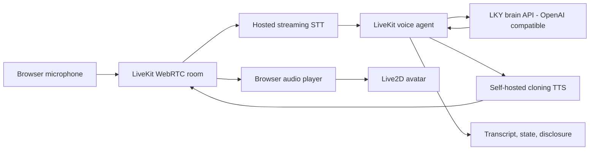

# LKY Avatar — Implementation Plan

> **Status: current working plan.** Supersedes the original draft (`plan.md`, kept at repo
> root for reference). Rewritten 2026-07-13 after a design review that changed the product
> framing, voice strategy, avatar pipeline, sequencing, and scope.

## 1. What this is

**A time-traveler LKY reasoning demo.** Elder Lee Kuan Yew, speaking as if present today,
answering modern questions — AI, today's geopolitics, anything — the way he *would* think:
his first principles, his pragmatism, his cadence. Not a historical fact archive.

The demo moment is not "what did you say in 1965?" It is "what do you make of AI?" —
answered with the shape of his reasoning, drawn from the LoRA, applied to the modern world
the base model knows.

One persona. One voice. One avatar. No era selection.

Target experience:

1. User opens the web app and starts talking. No push-to-talk, no era picker.
2. The transcript appears while the user speaks.
3. LKY begins answering shortly after the user finishes, in his cloned elder voice.
4. A Live2D avatar in a semi-realistic, dramatized art style speaks, blinks, breathes,
   and lip-syncs.
5. The user can interrupt at any time.
6. A persistent label discloses that everything is an AI-generated simulation.

## 2. Relationship to lky-brain

`lky-avatar` is a **separate repo** that consumes the brain. `lky-brain` stays a clean
training/dataset repo. Coupling is limited to exactly two things:

1. **Adapter weights** — the epoch-2 QLoRA, pulled from HuggingFace (`sjsim/lky-qlora`)
   at runtime. No code dependency.
2. **Persona/prompting logic** — `role_for()` / `system_prompt()` and the sampling
   settings are **vendored** into this repo (`lky_avatar/persona.py`, ~50 lines), with a
   one-off parity check against lky-brain's terminal chat output. No upstream refactor,
   no `feature/voice-avatar` branch in lky-brain.

Preserved inference settings (from lky-brain):

```yaml
enable_thinking: false
temperature: 0.7
top_p: 0.9
repetition_penalty: 1.1
```

- Epoch-2 adapter by default. Epoch-3 only if a new evaluation proves it better.
- Plain Transformers + PEFT + 4-bit NF4 for local inference. No Unsloth at inference
  (documented Qwen3 decode issue).

## 3. Decisions log

Decisions made in the 2026-07-13 review, replacing the original plan's assumptions:

| # | Decision | Consequence |
|---|---|---|
| 1 | Separate `lky-avatar` repo | lky-brain untouched; persona vendored; adapter from HF |
| 2 | **Time-traveler framing** — present-day date, no era picker | Era UI/resets and date-filtered-retrieval machinery cut; Milestone 0 gains an out-of-distribution persona test; no LoRA retrain |
| 3 | **One cloned elder-LKY voice** (no era voice profiles) | Hosted cloning providers require the voice owner's consent → **self-hosted open TTS (Chatterbox et al.) is the primary path**, not the fallback |
| 4 | **Live2D confirmed** (chosen over sprite/video/neural-head alternatives) with **AI-generated art + fully-DIY rigging** | One avatar, no age variants; style-feasibility rig test added early; budget $0 + a few weekends |
| 5 | **Retrieval deferred to v1.1** and reframed | Not fact-grounding; if it returns it is an "how he actually reasoned about analogous topics" panel. Anti-fabrication handled by prompt rule + eval set |
| 6 | **Walking skeleton first** | Full LiveKit voice loop with stock parts on day one; real components swapped in one at a time |
| 7 | **Hosting decided after local prototype** | Brain API must stay strictly OpenAI-compatible so hosting is swappable; production profile is an appendix |

## 4. Architecture

Modular STT → LLM → TTS pipeline. The LKY LoRA stays the reasoning core; no end-to-end
speech model.



### Locked choices

| Layer | Choice | Reason |
|---|---|---|
| Realtime transport | LiveKit | WebRTC, VAD, turn handling, barge-in, agent orchestration out of the box |
| Brain | Epoch-2 LoRA on Qwen3-14B | Preserves the trained reasoning style |
| Brain server (local) | Transformers + PEFT, 4-bit NF4 | Fits the 16GB RTX 5070 Ti |
| Brain API contract | OpenAI-compatible `/v1/chat/completions`, SSE streaming | Hosting becomes swappable behind one URL |
| STT | Hosted streaming provider | Lowest risk and latency; faster-whisper as offline fallback later |
| TTS | Self-hosted open cloning model (Chatterbox first candidate; blind-test vs F5-TTS / XTTS-v2 / Fish-Speech) | Hosted cloning is ToS-blocked for a real person's voice without consent |
| Avatar | Live2D Cubism for Web | True realtime audio-driven lip sync in the browser; the alternatives (sprites, video loops, neural heads) all sacrifice it |
| Persona frame | "It is <today>. You are Lee Kuan Yew, speaking as if present today, aware of current developments. Reason from your principles and experience; do not fabricate specific quotes, meetings, or memories." | The time-traveler framing; the anti-fabrication rule replaces retrieval-based grounding for v1 |

### Single-session constraint

Local 16GB serving allows **one active generation at a time**. The public showcase
accepts this: one live conversation, other visitors see a "LKY is speaking with someone —
please wait" state. Revisit only if real traffic demands it.

## 5. Costs

Everything is free or pennies except the brain GPU. Decision deferred until the local
prototype produces real VRAM/latency numbers (Milestone 6).

| Piece | Cost |
|---|---|
| Web frontend (Vercel / Cloudflare Pages) | $0 |
| LiveKit Cloud free tier | $0 at showcase scale |
| Hosted STT | pennies (~$0.36/hour of speech) |
| TTS | self-hosted → part of the GPU question |
| Avatar | $0 (AI art + DIY rig; Cubism Pro trial timed to rigging start) |
| Brain+TTS GPU, serverless scale-to-zero | ~$5–30/mo, 30–90 s cold start after idle |
| Brain+TTS GPU, always-on 24GB | ~$200–400/mo |
| Home 5070 Ti + Cloudflare Tunnel | $0, link dead when the PC is off |

## 6. Repository layout

```text
lky-avatar/
  docs/
    lky-avatar-plan.md         # this plan
  lky_avatar/
    persona.py                 # vendored role_for(), system_prompt()
  services/
    brain_api/                 # OpenAI-compatible streaming server
      app.py
      engine.py
      streaming.py
      config.py
    voice_agent/               # LiveKit agent
      agent.py
      session.py
      providers/
        stt.py
        tts.py
  web/
    src/
      livekit/
      avatar/                  # Live2DAvatar.ts, lipSync.ts, stateMachine.ts
      components/              # Conversation.tsx, Disclosure.tsx
    public/models/             # gitignored Live2D assets
  assets/
    voices/                    # gitignored reference clips + rights metadata
    avatar-source/             # gitignored art PSDs
  scripts/
    benchmark_brain.py
    benchmark_e2e.py
  tests/
  .env.example
  plan.md                      # original draft, superseded, kept for reference
```

Separate Python environments per service (brain inference / LiveKit agent / local TTS)
to avoid PyTorch–CUDA–audio dependency conflicts. Brain inference runs under WSL2 as in
lky-brain; note the WSL GPU-context-loss risk and prefer native Linux for any deployment.

## 7. Milestones

### Milestone 0 — repo setup, persona parity, time-travel test, baseline

- [ ] Scaffold the repo layout above; `.gitignore` for voices, art sources, model assets.
- [ ] Vendor `persona.py`; verify output parity against lky-brain terminal chat on
      identical prompts.
- [ ] **Out-of-distribution persona test**: run the existing model with a present-day
      (2026) system prompt against ~20 modern questions (AI, current geopolitics, social
      media, crypto, remote work…). The LoRA never saw dates beyond LKY's lifetime —
      verify the persona holds before anything else is built.
- [ ] Baseline benchmark on the 5070 Ti: load time, time-to-first-token, tokens/sec,
      peak VRAM, failure rate. Save as JSON for later comparison.

**Exit criteria:** persona parity confirmed; time-traveler framing produces in-character,
non-fabricating answers to modern questions; baseline numbers recorded.

**Gate:** if the 2026 framing breaks the persona, fall back to the fixed ~2011 date and
re-scope the "modern questions" pitch before proceeding.

### Milestone 1 — walking skeleton (day-one voice loop)

Stand up the full pipeline with **stock parts** before writing any custom code:

- [ ] LiveKit Cloud project + Python AgentServer from the official voice-agent starter.
- [ ] Hosted streaming STT, any stock hosted LLM, any stock TTS voice.
- [ ] Minimal browser client: mic capture, audio playback, live transcript.
- [ ] Experience barge-in and turn-taking as LiveKit ships them.
- [ ] Measure real end-of-speech → first-audio latency with all-stock parts.

**Exit criteria:** a complete spoken conversation with interruption works in the browser.
LiveKit's interaction feel is validated before any custom investment.

### Milestone 2 — LKY brain API, swapped into the skeleton

- [ ] Long-running model process: Qwen3-14B 4-bit NF4 + epoch-2 adapter, loads once.
- [ ] Iterator-based token streaming with cancellation (user barge-in aborts generation
      and releases resources).
- [ ] OpenAI-compatible `POST /v1/chat/completions` with `stream: true` (SSE),
      `GET /health`, `GET /v1/models`.
- [ ] Concurrency limited to one generation; unbounded token requests rejected;
      graceful CUDA-error recovery.
- [ ] Voice-friendly defaults: ~2–5 sentence answers, `max_tokens` ≈ 320.
- [ ] Point the skeleton's LLM client at it. **It is now LKY talking.**

**Exit criteria:** streaming + cancellation work from a test client; a 20-turn voice
conversation completes without restarting the model; answers match Milestone-0 quality.

### Milestone 3 — the voice

- [ ] Select one clean, late-era source (e.g. a 2000s interview); confirm usage rights;
      record source/date/processing/permission metadata locally. Assets stay out of Git.
- [ ] Prepare several 6–12 s single-speaker reference clips. Natural, not over-denoised.
- [ ] Blind-test candidate self-hosted TTS (Chatterbox, F5-TTS, XTTS-v2, Fish-Speech) on
      the same ~20 responses; score similarity, naturalness, intelligibility, pacing,
      stability, regional-term pronunciation (1–5 each). No choosing from one demo clip.
- [ ] Determine placement: does the winner fit beside the 14B on 16GB, or does it run on
      CPU / a second device? (Benchmark, don't assume.)
- [ ] Phrase-level streaming: segment LLM output at punctuation into 8–24-word chunks;
      queue ahead; cancel queue instantly on interruption.
- [ ] Pronunciation overrides for Singapore, Malay, Mandarin, Hokkien terms and acronyms
      (PAP, HDB, ASEAN…).
- [ ] **Keep the model's audio watermark intact. Never expose TTS as a public endpoint —
      only the agent can call it.**
- [ ] Swap into the pipeline; fall back to text-only if TTS fails.

**Exit criteria:** LKY answers in the cloned voice; speech starts before the full answer
is generated; interruption stops audio with no stale playback.

### Milestone 4 — placeholder avatar + style feasibility (parallel tracks)

**Track A — placeholder Live2D in the web client:**

- [ ] Load a licensed placeholder `.model3.json`; responsive canvas; static-image
      fallback.
- [ ] Idle breathing, blinking, small head movement.
- [ ] RMS lip sync from the *played* audio (Web Audio analyser); mouth closes the moment
      playback stops.
- [ ] Avatar state machine driven by agent state:
      `idle / listening / thinking / speaking / interrupted / error`.

**Track B — art pipeline (evenings, in parallel):**

- [ ] Iterate the LKY portrait with AI: semi-realistic, dramatized style
      (the "well-drawn AI anime dramatization" register), recognizably him.
- [ ] **Style-feasibility rig**: cut just mouth + eyelids from the best portrait and
      build a crude 2-parameter rig in the free Cubism Editor. One evening. Proves the
      painterly style survives being puppeteered *and* serves as rigging training.

**Exit criteria:** placeholder avatar speaks, blinks, and stops on interruption at
50+ FPS desktop; style-feasibility verdict recorded.

### Milestone 5 — interaction gate, then final art and DIY rig

**The gate (all three, measured, before serious rigging hours):**

1. Brain: stable streaming, no recurring OOM.
2. Voice: blind-test winner produces an acceptable LKY-like result.
3. Interaction: end-of-speech → first-audio p50 ≤ 4 s / p95 ≤ 8 s locally; interruption
   stop ≤ 350 ms; conversation *feels* good with the placeholder.

**Then:**

- [ ] Full layer-separated PSD from the final portrait (AI-assisted + manual cleanup).
- [ ] DIY rig in Cubism (start the 42-day Pro trial now, not earlier): head XYZ, eyes,
      independent blink, brows, mouth open/form, breathing, hair/clothing physics,
      shoulders. Expressions: neutral, stern, amused, emphatic, reflective.
- [ ] Lip-sync progression: RMS (already working) → word-aligned from TTS timestamps →
      viseme mapping if warranted. Measure offset (target ≤ 120 ms); don't tune by eye.
- [ ] Budget honestly: a few weekends. If rigging stalls, the placeholder remains
      shippable — art quality must not block v1.

**Exit criteria:** the real LKY model replaces the placeholder with the same state
machine and passes the same tests.

### Milestone 6 — hosting decision + hardening

- [ ] Price hosting with measured numbers (VRAM, tokens/sec, TTS placement) from the
      prototype: serverless scale-to-zero vs always-on vs home tunnel (§5).
- [ ] If serverless: honest cold-start UX — "waking the model up" state, canned intro
      line while loading.
- [ ] Single-session queue UI for concurrent visitors.
- [ ] LiveKit access tokens minted server-side, short-lived; all API keys server-side;
      basic rate limiting.
- [ ] Instrumentation: per-turn timestamps (speech end, STT final, LLM first token, first
      TTS audio, playback start, interruption → stop) recorded and reviewable.
- [ ] Stability pass: 30-minute session, 20-turn conversation, five rapid interruptions,
      STT/TTS failure recovery, brain restart, browser reconnect.

## 8. Evaluation

- **Persona (regression gate):** existing held-out eval must not fall below the epoch-2
  result. Modern-question set from Milestone 0 becomes a standing eval: in-character
  reasoning, no fabricated quotes/meetings/memories, admits uncertainty naturally.
- **STT:** ~30 recorded prompts — quiet/noisy, Singapore English, fast/slow, regional
  terms (Lee Kuan Yew, PAP, HDB, ASEAN, Malay/Mandarin/Hokkien words), short
  interruptions ("wait", "no"). Track WER and proper-noun accuracy.
- **Voice:** the Milestone-3 blind test protocol.
- **Avatar:** lip-sync offset, silence = closed mouth, blink cadence, FPS, interruption
  response, low-power fallback.
- **End-to-end:** the Milestone-6 stability pass.

## 9. Safety, rights, and trust

Product requirements, not optional copy:

- [ ] Persistent label: `AI-generated simulation. Not authentic Lee Kuan Yew audio or
      statements.` The time-traveler framing is *presented* as counterfactual — that is
      part of its honesty.
- [ ] Generated transcript always visible beside the audio.
- [ ] Never present generated wording as a real quotation; the system prompt forbids
      fabricated quotes, meetings, and memories.
- [ ] Voice reference clips: rights confirmed and recorded in local metadata; never
      committed.
- [ ] TTS watermark preserved; **no public endpoint that accepts arbitrary text and
      returns the cloned voice** — the voice speaks only as this persona, via the agent.
- [ ] No microphone audio stored by default; visible reset control.
- [ ] No implied endorsement by LKY's family, any archive, or the Singapore government.
- [ ] API keys server-side; sessions rate-limited.

## 10. Risk register

| Risk | Impact | Mitigation |
|---|---|---|
| 2026 framing breaks the LoRA persona | Core concept fails | Milestone-0 test with explicit fallback to fixed ~2011 date |
| Qwen + TTS compete for 16GB | OOM, severe latency | Benchmark TTS placement in Milestone 3; CPU or second device if needed |
| Archival reference audio too noisy | Poor clone | Several late-era clips, blind test, accept "good enough" — the persona carries the demo |
| Cloned voice of a real statesman, hosted publicly | Legal/reputational | Disclosure, watermark, persona-locked TTS, no arbitrary-text endpoint, revisit before going public |
| Semi-realistic style rigs poorly | Wasted art effort | Style-feasibility rig before full PSD work |
| DIY rigging stalls | v1 blocked on art | Placeholder avatar stays shippable; art never blocks v1 |
| Model fabricates memories/quotes | Trust damage | Prompt rule + standing eval; retrieval panel in v1.1 if needed |
| Interruption leaves stale audio | Feels broken | Cancel LLM + TTS queue + playback as one operation (built in Milestones 2–3) |
| WSL GPU context loss | Service crash | Health checks, clean restart; native Linux for deployment |
| Cold starts embarrass the demo | Bad first impression | Honest "waking up" UX; upgrade hosting only if traffic justifies |
| Dependency conflicts across services | Broken envs | Separate environments per service |

## 11. Definition of done (v1)

- [ ] One page, one button, one conversation — no era picker, no push-to-talk.
- [ ] User speaks; interim transcript appears; LKY answers in the cloned elder voice
      within the local latency targets, streaming before the answer is complete.
- [ ] He reasons in character about **modern** questions without fabricating specifics.
- [ ] Live2D avatar lip-syncs, blinks, and follows the agent state machine.
- [ ] Interruption stops audio, generation, and mouth movement promptly; conversation
      continues correctly.
- [ ] Disclosure visible throughout; transcript beside audio.
- [ ] 30-minute session completes without an unrecovered failure; latency metrics
      recorded.
- [ ] Voice-reference rights documented locally.
- [ ] Hosting chosen and priced from measured numbers (or consciously left on the home
      tunnel).

## 12. v1.1 candidates (explicitly out of v1)

- **Analogous-reasoning panel**: retrieval over the transcript corpus surfacing "how he
  actually reasoned about analogous topics" beside the generated answer — enrichment and
  provenance, not fact-grounding.
- faster-whisper offline STT fallback.
- Word-aligned / viseme lip sync if RMS feels insufficient.
- Multi-session serving (only if traffic exists).

## 13. Configuration sketch

```dotenv
# LiveKit
LIVEKIT_URL=
LIVEKIT_API_KEY=
LIVEKIT_API_SECRET=

# Brain (OpenAI-compatible, hosting-agnostic)
LKY_LLM_BASE_URL=http://127.0.0.1:8000/v1
LKY_LLM_API_KEY=local-development
LKY_MODEL_NAME=lky
LKY_ADAPTER=sjsim/lky-qlora   # epoch-2
LKY_MAX_TOKENS=320

# Speech
STT_PROVIDER=
TTS_PROVIDER=chatterbox
TTS_VOICE_REF_DIR=assets/voices/elder

# Privacy / telemetry
STORE_AUDIO=false
STORE_TRANSCRIPTS=false
ENABLE_LATENCY_METRICS=true
```

Never commit: real keys, reference audio, generated art PSDs, rigged model files,
rights metadata.

## 14. References

- lky-brain: https://github.com/pixiiidust/lky-brain
- Adapter: https://huggingface.co/sjsim/lky-qlora
- LiveKit Agents: https://docs.livekit.io/agents/
- LiveKit OpenAI-compatible LLMs: https://docs.livekit.io/agents/models/llm/openai-compatible-llms/
- LiveKit turn handling: https://docs.livekit.io/agents/logic/turns/
- Chatterbox TTS: https://github.com/resemble-ai/chatterbox
- F5-TTS: https://github.com/SWivid/F5-TTS
- Live2D Cubism: https://www.live2d.com/en/
- Live2D Web lip sync: https://docs.live2d.com/en/cubism-sdk-tutorials/native-lipsync-from-wav-web/
