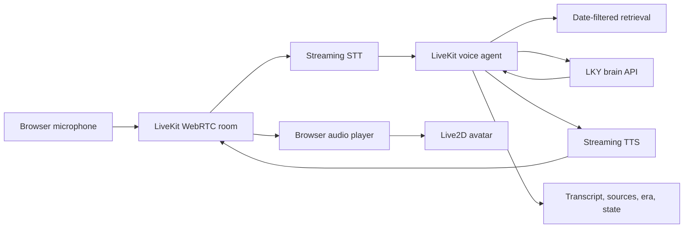

# LKY Voice and Interactive Anime Avatar Plan

## 1. Goal

Turn `lky-brain` into a realtime, voice-first historical simulation with:

- The existing Qwen3-14B epoch-2 LoRA as the reasoning core
- Streaming speech recognition and speech synthesis
- A custom Live2D anime avatar
- Era-aware appearance, title, knowledge, and voice
- Natural interruption and turn-taking
- Date-filtered retrieval from the LKY transcript corpus
- Clear disclosure that all speech and responses are AI-generated

The target experience:

1. User opens the web app and selects an era.
2. User speaks naturally.
3. The transcript appears while the user talks.
4. LKY begins answering shortly after the user finishes.
5. The avatar speaks, blinks, breathes, changes expression, and lip-syncs.
6. The user can interrupt at any time.
7. Relevant archival sources appear beside the answer.

## 2. Current baseline

The repository already provides the most important part, the persona model:

- Qwen3-14B base model
- Epoch-2 LoRA checkpoint as the recommended adapter
- 4-bit Transformers plus PEFT loading path
- Streaming terminal output
- Conversation history
- Date-based role and era prompting
- Non-thinking inference
- Sampling tuned for the transcript style

Preserve these inference settings from [`train/chat.py`](train/chat.py):

```yaml
enable_thinking: false
temperature: 0.7
top_p: 0.9
repetition_penalty: 1.1
```

Use epoch 2 by default. Do not use the epoch-3 adapter unless a new evaluation proves it is better.

Do not use the current Unsloth inference kernel. The repository documents a Qwen3 decode issue. Keep plain Transformers plus PEFT for the 16GB prototype.

## 3. Architecture decision

Use a modular STT to LLM to TTS pipeline. Do not replace the LKY LoRA with an end-to-end speech model.



### Locked choices

| Layer | Initial choice | Reason |
|---|---|---|
| Realtime transport | LiveKit | WebRTC, turn handling, interruption, agent orchestration |
| Brain | Existing epoch-2 LoRA | Preserves the trained LKY reasoning style |
| Local brain server | Transformers, PEFT, 4-bit | Fits the existing 16GB prototype setup |
| Production brain server | vLLM with LoRA | OpenAI-compatible streaming and better serving efficiency |
| STT | Hosted streaming provider first | Lowest implementation risk and better realtime latency |
| Local STT fallback | faster-whisper on CPU | Private fallback and useful for offline testing |
| TTS | Provider abstraction | Allows hosted custom voice and local Chatterbox testing |
| Local TTS candidate | Chatterbox-Turbo | English voice cloning with lower compute than larger TTS models |
| Avatar | Live2D Cubism for Web | Best fit for polished, expressive anime presentation |
| Grounding | Local vector index over rebuilt transcripts | Improves factual and era consistency |

## 4. Deployment profiles

### Profile A: existing 16GB prototype

Use this first.

- RTX 5070 Ti: Qwen3-14B plus epoch-2 LoRA only
- CPU or hosted service: STT
- Hosted service or second machine: TTS
- Browser GPU: Live2D rendering
- LiveKit Cloud or self-hosted LiveKit: realtime transport
- One active LLM generation at a time

Latency goals to validate:

| Metric | Prototype target |
|---|---:|
| End of user speech to first spoken audio, p50 | 4 seconds or less |
| End of user speech to first spoken audio, p95 | 8 seconds or less |
| User interruption to stopped playback | 350 ms or less |
| Avatar frame rate on desktop | 50 FPS or higher |

These are targets, not guarantees. Measure them on the actual machine before commissioning final avatar art.

### Profile B: recommended deployment

Use after the interaction is proven.

- 40GB-class GPU, or a validated 24GB quantized configuration: vLLM brain server
- Streaming hosted STT
- Streaming hosted custom TTS, or Chatterbox on a separate GPU host
- LiveKit agent deployed near the speech providers
- Web frontend served through a CDN

Latency goals to validate:

| Metric | Recommended target |
|---|---:|
| End of user speech to first spoken audio, p50 | 2.5 seconds or less |
| End of user speech to first spoken audio, p95 | 4.5 seconds or less |
| User interruption to stopped playback | 250 ms or less |
| Audio to lip movement offset | 120 ms or less |

## 5. Proposed repository layout

Keep the training and dataset pipeline intact. Add runtime services beside it.

```text
lky-brain/
  lky/
    persona.py                 # role_for(), system_prompt(), era helpers

  services/
    brain_api/
      app.py                   # health, models, chat completions
      engine.py                # model loading and generation
      streaming.py             # token streaming and cancellation
      schemas.py
      config.py

    voice_agent/
      agent.py                 # LiveKit AgentServer entrypoint
      session.py               # AgentSession construction
      prompting.py             # voice-friendly response policy
      retrieval.py             # retrieval hook
      events.py                # avatar and latency events
      providers/
        stt.py
        tts.py
        chatterbox.py

    retrieval/
      build_index.py
      index.py
      schemas.py

  web/
    src/
      app/
      livekit/
      avatar/
        Live2DAvatar.ts
        lipSync.ts
        stateMachine.ts
      components/
        Conversation.tsx
        EraPicker.tsx
        SourcePanel.tsx
        Disclosure.tsx
      telemetry/
    public/
      models/                  # gitignored licensed Live2D assets

  assets/
    voices/                    # gitignored reference clips
      1965/
      1990s/
      2000s/
    avatar-source/             # gitignored art source files

  scripts/
    benchmark_brain.py
    benchmark_e2e.py
    prepare_voice_reference.py
    smoke_test_session.py

  tests/
    brain_api/
    voice_agent/
    retrieval/
    e2e/

  .env.example
  docker-compose.yml
  plan.md
```

Use separate Python environments or containers for:

1. Training
2. Brain inference
3. LiveKit agent
4. Local TTS

This avoids PyTorch, CUDA, and audio dependency conflicts.

## 6. Milestones

## Milestone 0: baseline and decision gates

### Tasks

- [ ] Create branch `feature/voice-avatar`.
- [ ] Move `role_for()` and `system_prompt()` from `train/chat.py` into `lky/persona.py`.
- [ ] Update `train/chat.py` to import the shared functions.
- [ ] Add `scripts/benchmark_brain.py`.
- [ ] Record model load time, time to first token, tokens per second, peak VRAM, and failure rate.
- [ ] Run at least 20 prompts across 1965, 1990, 2005, and 2011.
- [ ] Save results as JSON so later changes can be compared.
- [ ] Prepare a small voice evaluation pack before choosing a TTS provider.

### Exit criteria

- Existing terminal chat still works.
- Epoch selection and date switching still work.
- No regression in current answer quality.
- Baseline latency and VRAM numbers exist.

### Decision gates

Do not pay for final Live2D rigging until all three gates pass:

1. Brain gate: stable streaming without repeated OOM failures.
2. Voice gate: one TTS option produces an acceptable LKY-like result.
3. Interaction gate: end-to-end first-audio latency is acceptable with a placeholder avatar.

## Milestone 1: LKY brain API

### Tasks

- [ ] Create a long-running model process so the model loads once.
- [ ] Load Qwen3-14B in 4-bit NF4 with the epoch-2 PEFT adapter.
- [ ] Replace terminal `TextStreamer` usage with an iterator-based streamer.
- [ ] Support cancellation when the user interrupts.
- [ ] Add an OpenAI-compatible `POST /v1/chat/completions` endpoint.
- [ ] Support `stream: true` using server-sent events.
- [ ] Add `GET /health` and `GET /v1/models`.
- [ ] Limit local concurrency to one generation.
- [ ] Reject unbounded token requests.
- [ ] Log request IDs and timing without storing message content by default.
- [ ] Add graceful recovery for CUDA and model errors.

### Required generation behavior

- Always use `enable_thinking=false`.
- Default to `temperature=0.7`.
- Default to `top_p=0.9`.
- Default to `repetition_penalty=1.1`.
- Use shorter voice answers by default, usually 2 to 5 sentences.
- Allow a frontend control for a longer answer.
- Stop cleanly on cancellation.

### API example

```json
{
  "model": "lky",
  "stream": true,
  "messages": [
    {
      "role": "system",
      "content": "You are Lee Kuan Yew, Prime Minister of Singapore, speaking candidly in an interview. It is August 1965."
    },
    {
      "role": "user",
      "content": "Will Singapore survive?"
    }
  ],
  "temperature": 0.7,
  "top_p": 0.9,
  "max_tokens": 320,
  "repetition_penalty": 1.1,
  "chat_template_kwargs": {
    "enable_thinking": false
  }
}
```

### Exit criteria

- Streaming works from `curl` or a test client.
- Cancellation stops generation and releases resources.
- A 20-turn text conversation completes without restarting the model.
- Date-conditioned prompts match the current terminal behavior.

## Milestone 2: LiveKit text agent

Build the orchestration layer before microphone and TTS work.

### Tasks

- [ ] Create the LiveKit AgentServer process.
- [ ] Connect LiveKit's OpenAI-compatible LLM client to the brain API.
- [ ] Add a per-session conversation history.
- [ ] Add an era date to session metadata.
- [ ] Generate the system prompt with `lky.persona.system_prompt(date)`.
- [ ] Add a minimal browser client that can send and receive text.
- [ ] Display agent states: connecting, listening, thinking, speaking, interrupted, error.
- [ ] Add `/reset` behavior in the UI.
- [ ] Reset history when the era changes.
- [ ] Add short-lived LiveKit access tokens from a server endpoint.

### Exit criteria

- User can select a date and chat through the browser.
- The browser receives streamed text.
- Era changes update role, prompt, and displayed date.
- The agent reconnects cleanly after a network interruption.

## Milestone 3: realtime speech

### 3A. Speech recognition

Start with a hosted streaming STT provider through LiveKit. Add local STT only after the main flow works.

- [ ] Add interim and final transcripts.
- [ ] Benchmark Singapore English, names, Malay terms, Mandarin terms, and noisy rooms.
- [ ] Add a custom vocabulary or pronunciation hints where supported.
- [ ] Add microphone permission, device selection, and mute controls.
- [ ] Add noise suppression only if it improves the test set.
- [ ] Add faster-whisper as an offline fallback.
- [ ] Do not save raw microphone audio by default.

### 3B. Voice reference preparation

- [ ] Confirm the right to use each archival clip.
- [ ] Select clean single-speaker clips.
- [ ] Remove interviewer speech, music, applause, and heavy room noise.
- [ ] Keep clips natural. Avoid aggressive denoising that changes timbre.
- [ ] Prepare several 6 to 12 second candidates per era.
- [ ] Keep all voice assets out of Git.
- [ ] Record clip source, date, processing steps, and permission status in local metadata.

Initial era profiles:

| Profile | Suggested date range | Goal |
|---|---|---|
| Young | Before 1980 | Faster, younger timbre |
| Mature | 1980 to 2003 | Firm, measured delivery |
| Elder | 2004 onward | Older timbre and slower pacing |

The MVP may begin with one neutral profile. Add age switching only after voice quality is stable.

### 3C. TTS provider abstraction

Implement one interface with multiple backends:

1. Hosted custom voice for the first low-latency benchmark
2. Chatterbox-Turbo on a separate GPU or machine
3. Generic fallback voice for development only

- [ ] Add `TTS_PROVIDER` configuration.
- [ ] Add voice ID or reference clip selection by era.
- [ ] Add pronunciation overrides for Singapore, regional names, and acronyms.
- [ ] Preserve any provider or model watermark.
- [ ] Never expose a public raw voice-cloning endpoint.
- [ ] Fall back to text-only if the selected voice fails.

For non-streaming TTS, segment LLM output by semantic phrase:

- Prefer punctuation boundaries.
- Aim for 8 to 24 words per phrase.
- Do not synthesize isolated tokens.
- Do not wait for the complete answer.
- Queue the next phrase while the current phrase plays.
- Cancel queued phrases immediately on interruption.

### 3D. Turn-taking and barge-in

- [ ] Configure endpointing and interruption through LiveKit.
- [ ] Stop browser playback when user speech is confirmed.
- [ ] Cancel queued TTS.
- [ ] Cancel active LLM generation.
- [ ] Preserve only text that the user actually heard.
- [ ] Detect false interruptions and resume when appropriate.
- [ ] Test coughs, keyboard noise, short acknowledgements, and overlapping speech.

### Exit criteria

- User can complete a full voice conversation without touching the keyboard.
- Interim transcripts appear during speech.
- LKY starts speaking before the full answer is generated.
- Interruption stops speech within the target latency.
- No stale audio plays after an interruption.

## Milestone 4: Live2D anime avatar

### 4A. Placeholder integration

Start with a licensed placeholder Live2D model.

- [ ] Load a `.model3.json` model in the web client.
- [ ] Add responsive canvas sizing.
- [ ] Add idle breathing, blinking, and small head movement.
- [ ] Drive mouth opening from the actual output audio analyser.
- [ ] Pause mouth movement when playback stops.
- [ ] Add a static-image fallback for unsupported browsers.

### 4B. Avatar state machine

Use these states:

```text
idle
listening
thinking
speaking
interrupted
error
```

Suggested behavior:

| State | Motion |
|---|---|
| Idle | Breathing, blinking, subtle eye movement |
| Listening | Eye contact, slight forward lean, minimal mouth movement |
| Thinking | Small gaze shift, restrained head movement |
| Speaking | Lip sync, occasional nods, expression changes |
| Interrupted | Mouth closes immediately, expression resets |
| Error | Neutral pose and visible status message |

### 4C. Lip sync progression

1. MVP: volume-based mouth opening from Web Audio RMS.
2. Improved: word-aligned mouth movement from TTS timestamps.
3. Final: phoneme or viseme mapping to Live2D mouth parameters.

Measure audio and visual timing. Do not tune lip sync only by eye.

### 4D. Custom LKY anime model

Commission final art only after the interaction gate passes.

Required rig parameters:

- Head X, Y, and Z
- Eye X and Y
- Independent blinking
- Brow position and angle
- Mouth open and mouth form
- Cheek and smile controls
- Breathing
- Hair and clothing physics
- Shoulder and upper-body movement

Required expressions:

- Neutral
- Stern
- Amused
- Emphatic
- Reflective

Create at least two age variants:

- Young or early-career LKY
- Elder statesman LKY

Tie avatar selection to the same date used by the brain and voice.

### Exit criteria

- Stable rendering at the target frame rate.
- Mouth closes immediately on interruption.
- No obvious lip movement during silence.
- State changes match the agent state.
- Date switching changes the configured avatar and voice together.

## Milestone 5: date-filtered retrieval and sources

The LoRA supplies style and reasoning. Retrieval should supply factual grounding.

### Tasks

- [ ] Rebuild transcript text locally from the existing corpus recipe.
- [ ] Create retrieval chunks with record ID, title, date, source, speaker, and text.
- [ ] Store the generated index outside Git.
- [ ] Add embeddings and a local vector index.
- [ ] Filter retrieval to records dated on or before the selected simulation date.
- [ ] Retrieve a small number of high-quality passages, usually 4 to 6.
- [ ] Add retrieved context to the LLM request without changing the core persona prompt.
- [ ] Tell the model to state uncertainty when evidence is missing.
- [ ] Show source cards in the UI.
- [ ] Distinguish paraphrases from authentic quotations.
- [ ] Never present generated text as an archival quote.

### Retrieval rules

```text
selected_date = simulation date
eligible_documents = documents where document_date <= selected_date
query = latest complete user turn plus concise conversation context
results = top passages after semantic search and metadata filtering
```

Use a strict no-future-information rule. A 1965 simulation must not retrieve a 1990 transcript.

### Exit criteria

- Source panel opens from every grounded response.
- Retrieval never crosses the selected date boundary.
- Answers remain useful when no relevant source exists.
- The UI clearly labels archival text versus generated text.

## Milestone 6: quality and latency tuning

### Instrumentation

Record these timestamps for every turn:

```text
user_speech_started
user_speech_ended
stt_final_received
retrieval_started
retrieval_finished
llm_request_started
llm_first_token
first_tts_request
first_tts_audio
browser_playback_started
interruption_detected
browser_playback_stopped
```

Calculate:

- STT finalization time
- Retrieval time
- LLM time to first token
- LLM tokens per second
- TTS time to first audio
- End-of-turn to playback latency
- Interruption stop latency
- Dropped and failed turns

### Brain optimizations

- [ ] Keep the model warm.
- [ ] Cap default spoken answers near 320 tokens.
- [ ] Summarize or trim old conversation history.
- [ ] Keep retrieved context small and relevant.
- [ ] Stream immediately after the first useful text arrives.
- [ ] Keep `repetition_penalty=1.1`.
- [ ] Add loop detection for repeated phrases.
- [ ] Test a production quantization before choosing 24GB hosting.
- [ ] Move to vLLM only after output parity tests pass.

### Speech optimizations

- [ ] Place agent and hosted speech services in nearby regions.
- [ ] Use streaming STT and streaming TTS where possible.
- [ ] Preconnect network sessions.
- [ ] Cache selected voice configuration.
- [ ] Avoid tiny TTS chunks.
- [ ] Avoid waiting for complete paragraphs.
- [ ] Test speaking speed and punctuation normalization.

### Avatar optimizations

- [ ] Keep rendering fully client-side.
- [ ] Compress textures without visible degradation.
- [ ] Limit physics calculations on low-power devices.
- [ ] Use the played audio signal, not generated audio timestamps alone, for basic mouth opening.

## 7. Evaluation plan

## 7A. Brain quality

Use the existing held-out evaluation as a regression gate.

Minimum requirements:

- Voice score must not fall below the current epoch-2 result.
- Era conditioning must remain correct.
- Repetition and filler loops must not increase.
- Retrieval must improve factual support without flattening the persona.
- The model must admit uncertainty when the indexed material is insufficient.

Create an interactive test set covering:

- 1965 independence and survival
- Housing and economic policy
- Race, language, and education
- Regional diplomacy
- Governance and corruption
- Personal and reflective questions
- Questions containing facts from a later era
- Questions with no reliable archival support

## 7B. STT quality

Create at least 30 recorded test prompts covering:

- Quiet room
- Fan or keyboard noise
- Singapore English
- Fast and slow speech
- Lee Kuan Yew, PAP, HDB, ASEAN, Malay, Mandarin, and Hokkien terms
- Short interruptions such as "wait" and "no"

Track word error rate and proper-noun accuracy.

## 7C. Voice quality

Blind-test candidate TTS systems on the same 20 responses.

Rate each sample from 1 to 5 for:

- Speaker similarity
- Naturalness
- Intelligibility
- Pacing
- Emotional restraint
- Stability across long sentences
- Pronunciation of regional terms

Choose the provider only after scoring. Do not choose from one impressive demo clip.

## 7D. Avatar quality

Test:

- Lip sync offset
- Mouth movement during silence
- Blink frequency
- Repeated motion patterns
- Expression appropriateness
- Frame rate
- Interruption response
- Mobile and low-power fallback behavior

## 7E. End-to-end stability

Pass all of these:

- 30-minute uninterrupted session
- 20-turn conversation
- Five rapid interruptions
- Era changed three times
- Temporary STT failure
- Temporary TTS failure
- Brain API restart
- Browser reconnect
- GPU memory monitored throughout

## 8. Safety, rights, and trust requirements

These are product requirements, not optional copy.

- [ ] Show a persistent label: `AI-generated historical simulation. Not authentic Lee Kuan Yew audio or statements.`
- [ ] Show the selected simulation date and role.
- [ ] Show generated transcripts beside the audio.
- [ ] Show archival sources when retrieval is used.
- [ ] Never describe generated wording as a real quotation.
- [ ] Confirm rights for archival audio, photographs, artwork, and transcript use.
- [ ] Keep Chatterbox or provider watermarks intact.
- [ ] Do not expose a public endpoint that accepts arbitrary text and returns the cloned voice.
- [ ] Rate-limit sessions and protect all API keys server-side.
- [ ] Do not store microphone audio by default.
- [ ] Provide a visible reset and session deletion control.
- [ ] Record consent and rights metadata for every voice asset.
- [ ] Do not imply endorsement by LKY, his family, an archive, or the Singapore government.

## 9. Configuration

Suggested `.env.example`:

```dotenv
# LiveKit
LIVEKIT_URL=
LIVEKIT_API_KEY=
LIVEKIT_API_SECRET=

# Brain
LKY_LLM_BASE_URL=http://127.0.0.1:8000/v1
LKY_LLM_API_KEY=local-development
LKY_MODEL_NAME=lky
LKY_ADAPTER=epoch2
LKY_DEFAULT_DATE=1965-08-09
LKY_MAX_TOKENS=320

# Speech
STT_PROVIDER=
TTS_PROVIDER=
TTS_VOICE_YOUNG=
TTS_VOICE_MATURE=
TTS_VOICE_ELDER=

# Local assets
LKY_VOICE_ASSET_DIR=assets/voices
LKY_RETRIEVAL_INDEX_DIR=data/runtime-index

# Privacy and telemetry
STORE_AUDIO=false
STORE_TRANSCRIPTS=false
ENABLE_LATENCY_METRICS=true
```

Do not commit real keys, voice IDs tied to private accounts, generated indexes, reference audio, or licensed avatar files.

## 10. Risk register

| Risk | Impact | Mitigation |
|---|---|---|
| Qwen and TTS compete for 16GB GPU | OOM and severe latency | Keep TTS off the brain GPU |
| Local Transformers server is slow | Delayed first audio | Use short responses, stream early, move production to vLLM |
| Archival audio is noisy | Poor cloned voice | Prepare several clean era-matched references and blind-test them |
| Voice sounds convincing but unstable | Uncanny experience | Clause segmentation, pronunciation rules, long-sentence tests |
| Avatar feels robotic | Low perceived quality | Custom Live2D rig, restrained motion, state-based behavior |
| Avatar feels deceptive | Trust and reputational harm | Persistent disclosure, visible date, generated transcript, sources |
| Model invents facts or quotations | Historical inaccuracy | Date-filtered retrieval, uncertainty behavior, source panel |
| Future facts leak into past eras | Broken simulation | Hard metadata filter before retrieval |
| User interruption leaves stale audio | Conversation feels broken | Cancel LLM, TTS queue, and playback as one operation |
| WSL GPU context is lost | Service crash | Health checks, clean restart, use native Linux for deployment |
| Python dependencies conflict | Broken environments | Separate environments or containers per service |
| Provider lock-in | Cost or availability risk | STT and TTS provider interfaces, self-hostable LiveKit |
| Licensed assets enter Git | Legal and distribution risk | Gitignore assets and maintain a local rights manifest |

## 11. Definition of done

The first complete release is done when:

- [ ] User opens one web page and starts a session.
- [ ] User selects a simulation date.
- [ ] Correct role, avatar, and voice profile load for that date.
- [ ] User speaks without push-to-talk.
- [ ] Interim transcript appears.
- [ ] LKY begins speaking within the selected profile's latency target.
- [ ] Text streams before the complete answer is ready.
- [ ] Avatar lip sync follows the audio.
- [ ] User interruption stops speech and generation promptly.
- [ ] Conversation continues correctly after interruption.
- [ ] Source cards appear for grounded answers.
- [ ] No future-dated source is used.
- [ ] Disclosure remains visible throughout the session.
- [ ] A 30-minute test session completes without an unrecovered failure.
- [ ] Latency metrics are recorded and reviewable.
- [ ] Voice, likeness, and source rights have documented status.

## 12. First implementation sequence

Work in this order:

1. Shared persona module and baseline benchmark
2. Streaming brain API with cancellation
3. LiveKit text-only agent
4. Browser text client and era picker
5. Hosted streaming STT
6. Hosted custom TTS benchmark
7. Barge-in and cancellation
8. Placeholder Live2D avatar with RMS lip sync
9. End-to-end latency benchmark
10. Local Chatterbox comparison on separate hardware
11. Date-filtered retrieval and source panel
12. Final TTS choice
13. Custom Live2D art and rigging
14. Production vLLM deployment
15. Security, rights, load, and regression review

## 13. Initial pull request checklist

The first pull request should contain only the foundation:

- [ ] `plan.md`
- [ ] `lky/persona.py`
- [ ] Updated `train/chat.py`
- [ ] `services/brain_api/` skeleton
- [ ] Streaming chat completion endpoint
- [ ] Cancellation test
- [ ] Brain benchmark script
- [ ] `.env.example`
- [ ] Asset and runtime-index `.gitignore` rules
- [ ] README section explaining how to run the brain API

Do not mix Live2D, STT, TTS, retrieval, and brain refactoring into the same first pull request.

## 14. Reference documentation

- Project repository: https://github.com/pixiiidust/lky-brain
- LiveKit Agents: https://docs.livekit.io/agents/
- LiveKit OpenAI-compatible LLMs: https://docs.livekit.io/agents/models/llm/openai-compatible-llms/
- LiveKit turn handling: https://docs.livekit.io/agents/logic/turns/
- Chatterbox TTS: https://github.com/resemble-ai/chatterbox
- faster-whisper: https://github.com/SYSTRAN/faster-whisper
- Live2D Web lip sync: https://docs.live2d.com/en/cubism-sdk-tutorials/native-lipsync-from-wav-web/
